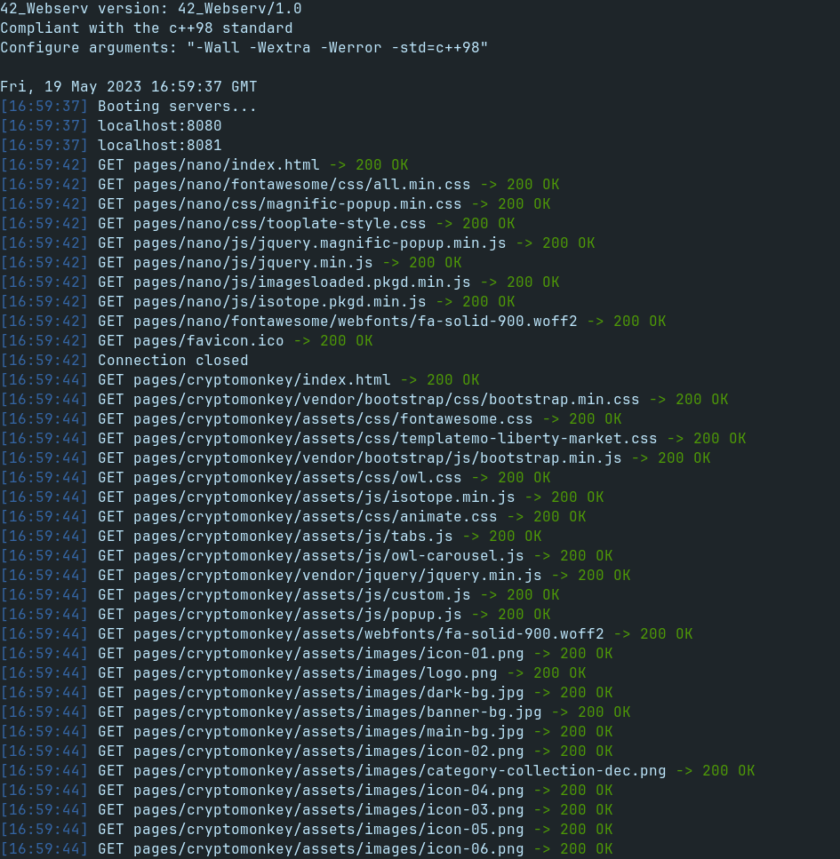

# webserv (42Porto - 42Cursus)  

Project done in collaboration with:  
[Rodrigo Ramos](https://github.com/ramos21rodrigo)  
[João Arsénio](https://github.com/RealMadnessWorld)  

### Grade: 100/100

### Demonstration  

### Description  
42_Webserv is a web server written from scratch in C++ (C++98), capable of handling multiple clients simultaneously.  

> Disclaimer: Only tested with Firefox

### Features  
- NGINX-like configuration file  
- Handling of the **GET**, **POST** and **DELETE** HTTP request methods  
- File upload  
- Python CGI support   

### Installing and running the project  
1- Installing webserv dependencies:  

	sudo apt-get install c++ make  
2- Clone this repository:  

	git clone https://github.com/Kuninoto/42_webserv
3- Navigate to _lvl_5_webserv_ and run `make`

	cd 42_webserv/lvl_5_webserv
	make
4- `make clean` so that you don't keep those object files that you won't need anymore  

	make clean
5- Run webserv

	./webserv <config_file>
	or
	./webserv
	which is the same as:
	./webserv config/default.conf

6- Open Firefox and search for localhost:8080

#### Makefile available targets  
`make` or `make all` - compiles `webserv`  
`make clean` - wipes all object files  
`make fclean` - deletes webserv and all object files  
`make re` - `fclean`  + `all`  

### Useful links

**What is HTTP?**  
[Definition](https://en.wikipedia.org/wiki/Hypertext_Transfer_Protocol)  
[HTTP Crash Course & Exploration](https://www.youtube.com/watch?v=iYM2zFP3Zn0)   

**Understanding HTTP**  
HTTP Request Methods:  
[Overview](https://www.youtube.com/watch?v=tkfVQK6UxDI)  
[GET](https://developer.mozilla.org/en-US/docs/Web/HTTP/Methods/GET#syntax)  
[POST](https://developer.mozilla.org/en-US/docs/Web/HTTP/Methods/POST)  
[DELETE](https://developer.mozilla.org/en-US/docs/Web/HTTP/Methods/DELETE)  

[HTTP Docs](https://developer.mozilla.org/en-US/docs/Web/HTTP)  
[HTTP Header Fields](https://en.wikipedia.org/wiki/List_of_HTTP_header_fields)  

**What is a Web Server?**  
[Definition](https://en.wikipedia.org/wiki/Web_server)  
[Concepts and Examples](https://www.youtube.com/watch?v=9J1nJOivdyw)  
[How to build a simple HTTP server from scratch](https://medium.com/from-the-scratch/http-server-what-do-you-need-to-know-to-build-a-simple-http-server-from-scratch-d1ef8945e4fa)  

**Sockets**  
[Definition](https://en.wikipedia.org/wiki/Network_socket)  
[What exactly is a Socket?](https://stackoverflow.com/questions/16233193/what-exactly-is-socket)

**I/O Multiplexing**  
[Socket programming with select(), poll() and epoll() in Linux](https://www.youtube.com/watch?v=dEHZb9JsmOU&t=1035s)
[poll() man page](https://linux.die.net/man/2/poll)  

**NGINX**  
[Definition](https://en.wikipedia.org/wiki/Nginx)  
[Understanding NGINX configuration file](https://www.digitalocean.com/community/tutorials/understanding-the-nginx-configuration-file-structure-and-configuration-contexts)  

**CGI**  
[Common Gateway Interface (CGI)](https://en.wikipedia.org/wiki/Common_Gateway_Interface)  
[Python CGI Programming](https://www.youtube.com/watch?v=hV1NWnbC-D8)  

**General**  
[Blocking vs. Non-blocking I/O](https://www.linuxtoday.com/blog/blocking-and-non-blocking-i-0/)  
[URL vs. URI](https://stackoverflow.com/questions/4239941/difference-between-url-and-uri)  

---
Made by Nuno Carvalho (Kuninoto) | nnuno-ca@student.42porto.com  

 <a href="https://www.linkedin.com/in/nuno-carvalho-218822247"/> &nbsp;
